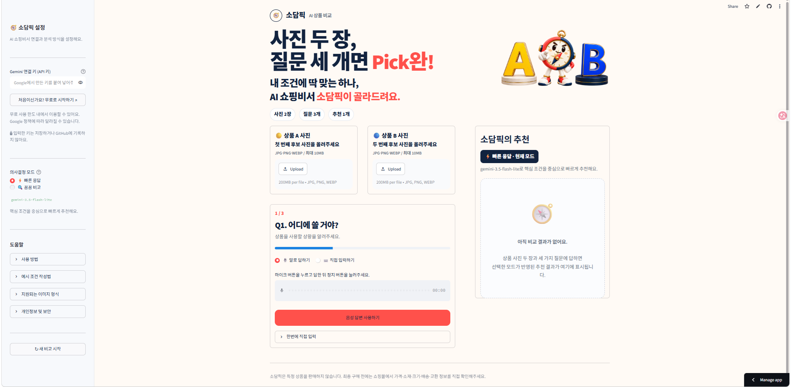
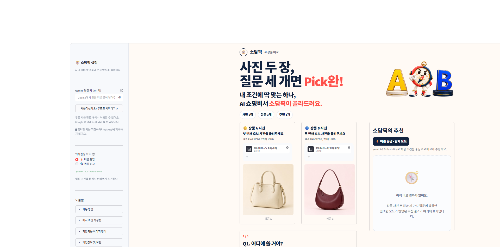
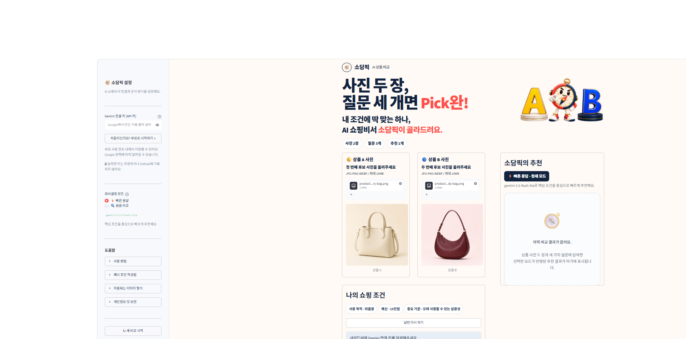
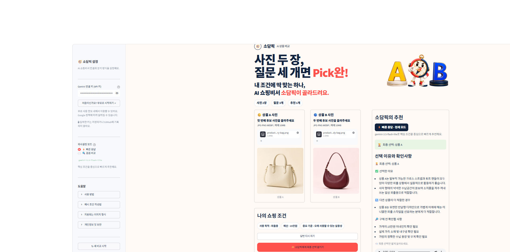

# 🧭 소담픽 (SodamPick)

> **사진 두 장, 질문 세 개면 Pick완!**  
> 내 조건에 딱 맞는 하나, AI 쇼핑비서 소담픽이 골라드려요.

[🌐 소담픽 실행하기](https://sodampick-shopping-assistant.streamlit.app/)

---

## 1. 서비스 개요

소담픽은 최종 후보 두 상품 사이에서 결정을 내리기 어려운 사용자를 위한 AI 쇼핑비서입니다. 사용자가 상품 A와 B의 사진을 올리고 사용 목적, 예산, 중요 기준을 입력하면 Gemini가 두 상품의 보이는 특징을 조건과 연결하여 비교하고 하나를 추천합니다.

소담픽은 새로운 상품을 검색하거나 특정 상품을 광고하는 서비스가 아닙니다. 이미 두 개까지 후보를 좁힌 사용자의 **마지막 선택**을 돕는 데 집중합니다.

---

## 2. 주요 사용자

- 비슷한 두 상품 중 하나를 고르기 어려운 사람
- 광고성 추천보다 자신의 조건을 반영한 비교가 필요한 사람
- 복잡한 비교표보다 최종 선택과 핵심 이유를 빠르게 확인하고 싶은 사람

---

## 3. 소담픽이 잘하는 일

| 핵심 기능 | 내용 |
| --- | --- |
| A·B 상품 비교 | 최종 후보 두 상품의 사진을 나란히 분석합니다. |
| 사용자 조건 반영 | 사용 목적, 예산, 가장 중요한 기준을 추천에 반영합니다. |
| 단계형 질문 | 질문을 한 번에 하나씩 제시하여 입력 부담을 줄입니다. |
| 음성·직접 입력 | 상황에 따라 음성 또는 키보드로 조건을 입력할 수 있습니다. |
| 두 가지 분석 방식 | 빠른 응답과 꼼꼼 비교 중 원하는 방식을 선택할 수 있습니다. |
| 최종 하나 추천 | 상품 A, 상품 B 또는 둘 다 사지 않기 중 하나를 제안합니다. |
| 근거와 확인사항 | 선택 이유와 구매 전 추가로 확인할 정보를 함께 제공합니다. |
| 짧은 음성 안내 | 최종 선택 결과만 간단한 한국어 음성으로 들려줍니다. |

---

## 4. 서비스 이용 흐름

1. 사이드바에 개인 Gemini 연결 키(API 키)를 입력합니다.
2. `빠른 응답` 또는 `꼼꼼 비교`를 선택합니다.
3. 비교할 상품 A와 B의 사진을 각각 올립니다.
4. 사용 목적, 예산, 중요 기준에 관한 세 가지 질문에 답합니다.
5. `소담픽에게 최종 선택 맡기기` 버튼을 누릅니다.
6. 최종 선택, 선택 이유, 다른 상품이 적합한 경우와 구매 전 확인사항을 확인합니다.
7. 필요한 경우 결과를 음성으로 듣거나 텍스트 파일로 저장합니다.

---

## 5. 의사결정 모드

| 화면 표시 | 연결 모델 | 사용 목적 |
| --- | --- | --- |
| ⚡ 빠른 응답 | `gemini-3.5-flash-lite` | 핵심 조건을 중심으로 결과를 빠르게 확인할 때 사용합니다. |
| 🔍 꼼꼼 비교 | `gemini-3.6-flash` | 두 상품의 차이와 확인사항을 조금 더 자세히 검토할 때 사용합니다. |

사용자는 모델명을 직접 고르는 대신 자신에게 필요한 분석 방식을 선택합니다. 선택한 모드와 설명은 추천 결과 영역에도 표시됩니다.

---

## 6. 서비스 화면

| ① 시작 화면 | ② 상품 사진 등록 |
| --- | --- |
|  |  |

| ③ 쇼핑 조건 입력 | ④ 최종 추천 결과 |
| --- | --- |
|  |  |

> 위 화면을 표시하려면 저장소에 `screenshots` 폴더를 만들고 같은 이름의 이미지 4장을 올려주세요.

---

## 7. 주요 기술과 역할

| 기술·라이브러리 | 서비스에서 담당하는 역할 |
| --- | --- |
| Streamlit | 웹 화면, 사이드바, 파일 업로드, 단계형 질문과 결과 영역을 구성합니다. |
| Google Gemini | 두 상품 이미지와 사용자 조건을 함께 분석하고 추천 결과를 생성합니다. |
| Pillow | JPG, PNG, WEBP 이미지를 분석 가능한 JPEG 형식으로 변환합니다. |
| `st.audio_input` | 브라우저에서 사용자의 음성 답변을 녹음합니다. |
| gTTS | 최종 선택 결과를 짧은 한국어 음성으로 변환합니다. |
| `st.session_state` | 질문 단계, 사용자 답변과 추천 결과를 유지합니다. |

---

## 8. 예외 처리

소담픽은 다음 상황에서 사용자가 해결 방법을 알 수 있도록 안내 문구를 표시합니다.

- Gemini 연결 키가 입력되지 않았거나 권한이 없는 경우
- 상품 A·B 사진 중 하나가 누락된 경우
- 이미지가 비어 있거나 손상되었거나 10MB를 초과한 경우
- 사용 목적, 예산 또는 중요 기준이 입력되지 않은 경우
- API 사용 한도 초과, 모델 사용 불가 또는 서버 오류가 발생한 경우
- 네트워크 연결이 불안정한 경우
- 음성 인식이나 음성 출력에 실패한 경우

음성 출력에 실패하더라도 텍스트 추천 결과는 유지되도록 처리했습니다.

---

## 9. 개인정보와 이용 시 주의사항

- 입력한 Gemini 연결 키는 비밀번호 형식으로 가려서 표시합니다.
- 연결 키를 코드나 GitHub 저장소에 직접 기록하지 않습니다.
- 개인정보가 포함된 상품 사진은 올리지 않는 것을 권장합니다.
- 사진만으로 확인할 수 없는 가격, 소재, 크기와 내구성은 임의로 단정하지 않습니다.
- 최종 구매 전에는 판매처에서 가격, 소재, 크기, 배송과 교환 정보를 직접 확인해야 합니다.

---

## 10. 프로젝트 구조

```text
sodampick-shopping-assistant/
├── README.md
├── streamlit_app.py
├── requirements.txt
├── sodampick_hero.png
├── sodampick_shopping_assistant.ipynb
└── screenshots/
    ├── 01_home.png
    ├── 02_product_upload.png
    ├── 03_conditions.png
    └── 04_result.png
```

---

## 11. 실행 방법

### 필요한 라이브러리 설치

```bash
pip install -r requirements.txt
```

### Streamlit 앱 실행

```bash
streamlit run streamlit_app.py
```

앱 실행 후 사이드바에 개인 Gemini 연결 키를 입력해야 상품 비교 기능을 사용할 수 있습니다.

---

## 12. 한계와 향후 개선 방향

- 현재는 상품 사진과 사용자가 입력한 조건을 중심으로 비교합니다.
- 실시간 판매 가격, 재고, 배송 정보와 사용자 리뷰는 직접 조회하지 않습니다.
- 향후 상품 상세정보 입력, 비교 이력 저장, 추천 만족도 평가 기능을 추가할 수 있습니다.

---

## 13. Closing

소담픽은 많은 상품을 추천하는 서비스가 아니라, **마지막 두 후보 사이에서 멈춘 사용자가 자신의 조건에 맞는 하나를 선택하도록 돕는 AI 쇼핑비서**입니다.

